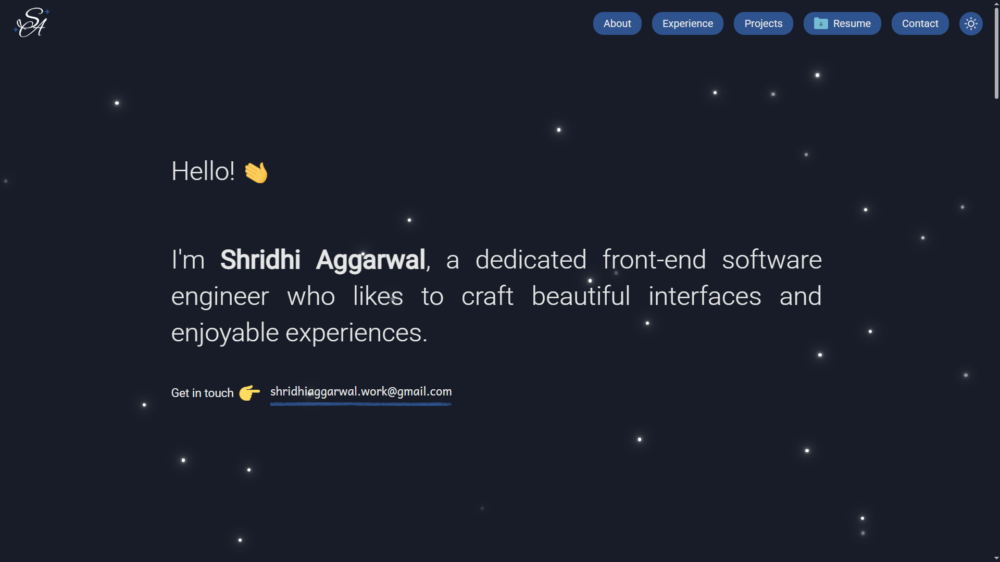
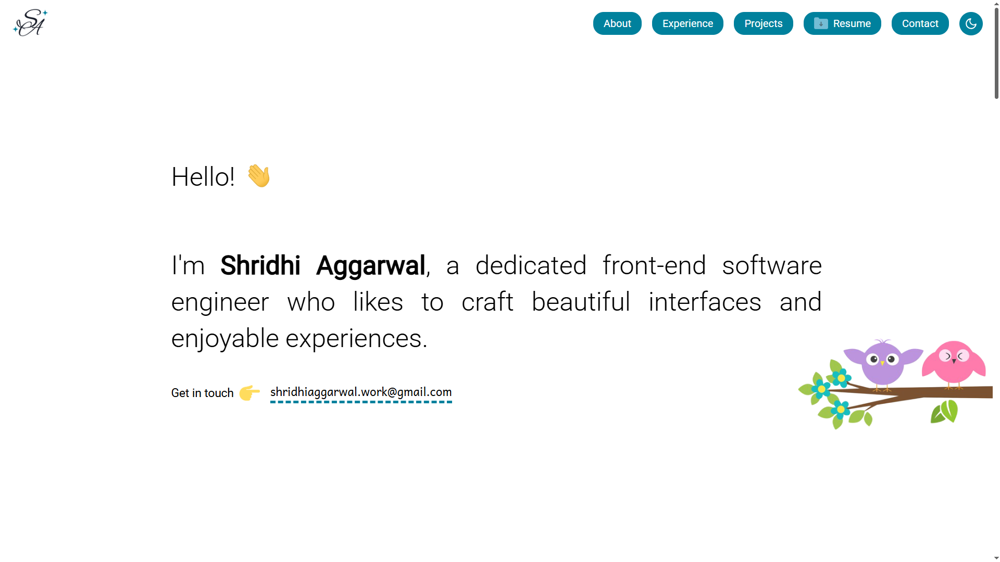

#  Shridhi Aggarwal - Portfolio

A modern, responsive personal portfolio website built with HTML, CSS, and JavaScript to showcase my skills, projects, and experience as a senior software engineer.

## 🔗 Live Demo

[shridhiaggarwal.github.io](https://shridhiaggarwal.github.io)

## ✨ Features

- **Responsive Design**: Works seamlessly across all devices
- **Dark/Light Theme**: Dynamic theme switching
- **Interactive Navigation**: Smooth scrolling navigation
- **Project Showcase**: Live demos and GitHub links
- **Skills Section**: Visual representation of technical skills
- **Contact Integration**: Direct links to professional profiles

## 🛠️ Technologies & Tools

- **HTML5** | **CSS3** | **JavaScript (ES6+)**
- **Google Fonts** | **Devicon** | **GitHub Pages**

## 🚀 Getting Started

1. **Clone the repository**

   ```bash
   git clone https://github.com/shridhiaggarwal/shridhiaggarwal.github.io.git
   ```

2. **Open the project**

   - Open `index.html` in your browser
   - Or use Live Server extension in VS Code

3. **View the website**

## 📧 Contact

- **Email**: shridhiaggarwal.work@gmail.com
- **LinkedIn**: [Shridhi Aggarwal](https://www.linkedin.com/in/shridhi-aggarwal/)
- **GitHub**: [shridhiaggarwal](https://github.com/shridhiaggarwal)


## 🌙 Dark Theme



## ☀️ Light Theme



**Built with ❤️ by Shridhi Aggarwal**

